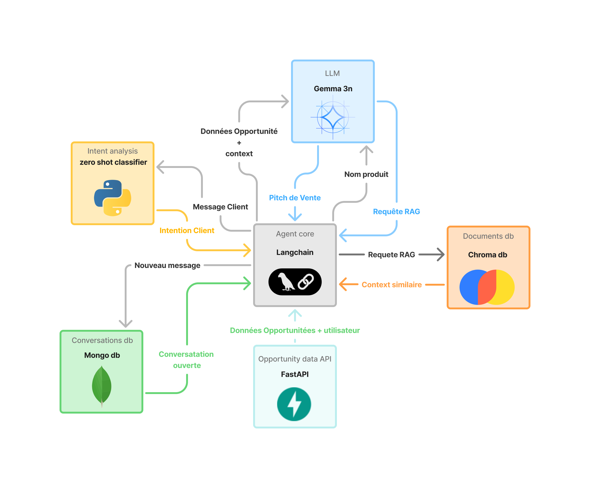
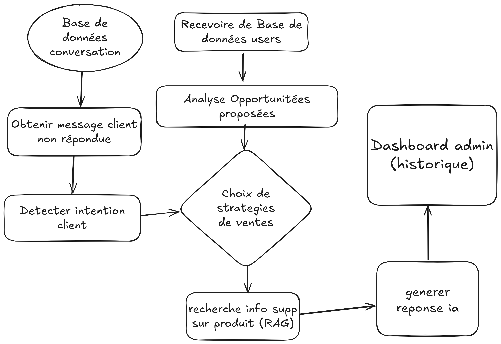

# Next Deal — Comprehensive Documentation

## Executive Summary

**Next Deal** is a modular, AI-driven insurance sales and client engagement platform for BH Assurance. It leverages state-of-the-art conversational AI, retrieval-augmented generation (RAG), intent analysis, and multi-channel integration (web, email, Kafka) to automate, personalize, and streamline client interactions, product recommendations, and operational workflows.

---

## System Architecture

The platform is composed of several tightly integrated subsystems:

- **AI Agent Orchestration:** Central logic for managing conversations, generating responses, and coordinating with other modules.
- **RAG (Retrieval-Augmented Generation):** Semantic search over legal and product documents to enrich AI responses.
- **Intent Analysis:** Hybrid rule-based and ML-powered detection of user intent and product interest.
- **API Datasets (FastAPI):** Microservices for recommendations, guarantees, invoices, and renewals.
- **MongoDB Integration:** Persistent storage for clients, conversations, and messages.
- **Email Integration:** Automated email ingestion and reply handling via Gmail API and webhooks.
- **Web Frontend (React/TypeScript):** Admin dashboard for analytics, validation, and client management.
- **Backend (Node.js/Express):** RESTful API, business logic, and security middleware.
- **Kafka Pipeline:** Event streaming for scalable integrations and automation.
- **Configuration & Utilities:** Shared constants, helpers, and connectors.

---

## Component Interactions

### High-Level Architecture Diagram



*This diagram illustrates the flow of data and interactions between the main components: LLM, RAG, MongoDB, FastAPI, and the agent core.*

---

### 1. **AI Agent Orchestration**

- **Location:** [`agent/agent.py`](agent/agent.py), [`agent/app.py`](agent/app.py)
- **Function:** Orchestrates the entire conversation lifecycle, leveraging LLMs via [`agent/utils/llm_utils.py`](agent/utils/llm_utils.py).
- **Data Flow:** 
  - Fetches user profiles and recommendations from FastAPI microservices.
  - Retrieves conversation history and status from MongoDB.
  - Injects RAG context and intent analysis into LLM prompts for tailored responses.
  - Logs all interactions for compliance and validation.

### 2. **Retrieval-Augmented Generation (RAG)**

- **Location:** [`agent/rag_model/rag.py`](agent/rag_model/rag.py), [`agent/rag_model/document-parseer.py`](agent/rag_model/document-parseer.py)
- **Function:** Parses and embeds PDFs/CSVs into ChromaDB for semantic search.
- **Usage:** Agent queries RAG for relevant legal/product context, which is dynamically injected into LLM prompts.

### 3. **Intent Analysis**

- **Location:** [`agent/intent_analysis/intent_analysis.py`](agent/intent_analysis/intent_analysis.py)
- **Function:** Detects user intent and product mentions using both rule-based patterns and transformer models.
- **Usage:** Guides agent decision-making for recommendations, escalation, and workflow routing.

### 4. **API Datasets (FastAPI)**

- **Location:** [`api_datasets/app.py`](api_datasets/app.py)
- **Function:** Serves as the backend for product, guarantee, invoice, and renewal recommendations.
- **Usage:** Queried by the agent for real-time, personalized suggestions.

### 5. **MongoDB Integration**

- **Location:** [`agent/utils/mongodb_conn.py`](agent/utils/mongodb_conn.py), backend models
- **Function:** Stores all persistent data (clients, conversations, messages, validation status).
- **Usage:** Enables robust tracking, auditing, and validation workflows.

### 6. **Email Integration**

- **Location:** [`agent/utils/mail_reciever.py`](agent/utils/mail_reciever.py), backend webhook
- **Function:** Automates email ingestion, reply handling, and synchronization with MongoDB.
- **Usage:** Ensures multi-channel engagement and seamless conversation tracking.

### 7. **Web Frontend**

- **Location:** [`web/BH-Assurance/frontend/`](web/BH-Assurance/frontend/)
- **Function:** Provides dashboards for analytics, validation, and client management.
- **Usage:** Admins review, edit, and approve AI-generated responses; monitor KPIs and workflow status.

### 8. **Backend (Node.js/Express)**

- **Location:** [`web/BH-Assurance/backend/`](web/BH-Assurance/backend/)
- **Function:** REST API for clients, conversations, messages, and email webhooks; implements security and business logic.
- **Usage:** Serves both frontend and agent; enforces rate limiting and authentication.

### 9. **Kafka Pipeline**

- **Location:** [`pipeline/kafka/docker-compose.yml`](pipeline/kafka/docker-compose.yml), [`entrypoint.sh`](entrypoint.sh), [`plugins.sh`](plugins.sh)
- **Function:** Event streaming for scalable integrations (e.g., notifications, external systems).
- **Usage:** Enables real-time automation and future extensibility.

---

## Workflow Overview

### Process Flow Diagram



*This diagram shows the step-by-step workflow from receiving a client message to generating and validating an AI response.*

---

## Deployment & Operations

### Prerequisites

- Python 3.11+
- Node.js 18+
- MongoDB 6+
- Docker & Docker Compose
- Kafka (via Docker)
- ChromaDB (via Docker)
- Gmail API credentials (`credentials.json`, `token.json`)

### Setup Steps

1. **Clone the repository:**
   ```bash
   git clone https://github.com/roudayn-kouka/BH-Assurance.git
   cd BH-Assurance
   ```

2. **Start infrastructure:**
   ```bash
   docker-compose up -d
   ```

3. **Install Python dependencies:**
   ```bash
   cd agent
   pip install -r requirements.txt
   ```

4. **Install Node.js dependencies:**
   ```bash
   cd web/BH-Assurance/backend
   npm install
   ```

5. **Configure Gmail API:**
   - Place `credentials.json` and `token.json` in `agent/utils/`.
   - Run the mail receiver once to authenticate.

6. **Start the AI agent:**
   ```bash
   cd agent 
   python app.py
   ```

7. **Start backend and frontend:**
   ```bash
   # Backend
   cd web/BH-Assurance/backend
   npm run dev

   # Frontend
   cd ../frontend
   npm run dev
   ```

---

## Validation & Governance Workflow

- AI-generated responses are flagged as `pending` in MongoDB.
- Admins review, edit, and approve responses via the frontend dashboard.
- Only validated responses are sent to clients, ensuring compliance and quality control.
- All actions are logged for auditability.

---

## Security & Compliance

- JWT authentication and robust rate limiting (`rate-limit.middleware.ts`) protect all APIs.
- Sensitive credentials and tokens are excluded from version control (`.gitignore`).
- All data access and modifications are logged for regulatory compliance.

---

## Extensibility & Customization

- **Product Expansion:** Update product keywords and recommendation logic in `intent_analysis.py` and FastAPI endpoints.
- **Channel Integration:** Add Kafka connectors or webhook handlers for new communication channels (SMS, WhatsApp, etc.).
- **Prompt Engineering:** Refine prompt templates in `config.py` for improved LLM performance and multilingual support.
- **Analytics:** Extend frontend dashboards to visualize new KPIs or workflow metrics.

---

## Best Practices

- **Separation of Concerns:** Each module is self-contained and communicates via well-defined interfaces.
- **Scalability:** Kafka and Docker Compose enable horizontal scaling and future integrations.
- **Auditability:** All critical actions are logged and traceable.
- **Validation:** Human-in-the-loop workflows ensure AI outputs meet business and regulatory standards.

---

## License

This project is proprietary to BH Assurance. For usage, extension, or partnership inquiries, contact the project owner.

---

## Support & Contact

For technical support, feature requests, or bug reports, please contact the project maintainer or use the internal ticketing system.

---

## Appendix: Directory Structure

```
agent/
  ├── agent.py
  ├── app.py
  ├── config.py
  ├── rag_model/
  ├── intent_analysis/
  ├── utils/
web/
  ├── BH-Assurance/
      ├── backend/
      ├── frontend/
pipeline/
  ├── kafka/
      ├── docker-compose.yml
```

---

**Next Deal** is designed for reliability, compliance, and extensibility. For further documentation, see inline code comments and module docstrings.